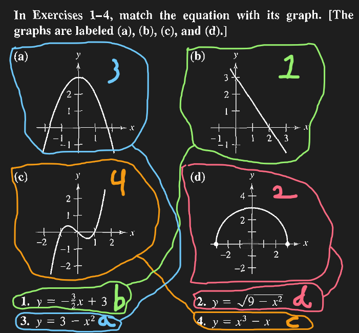
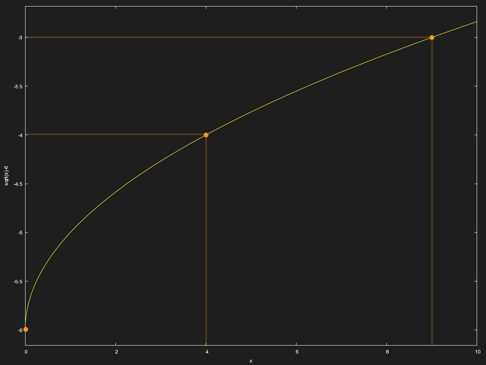
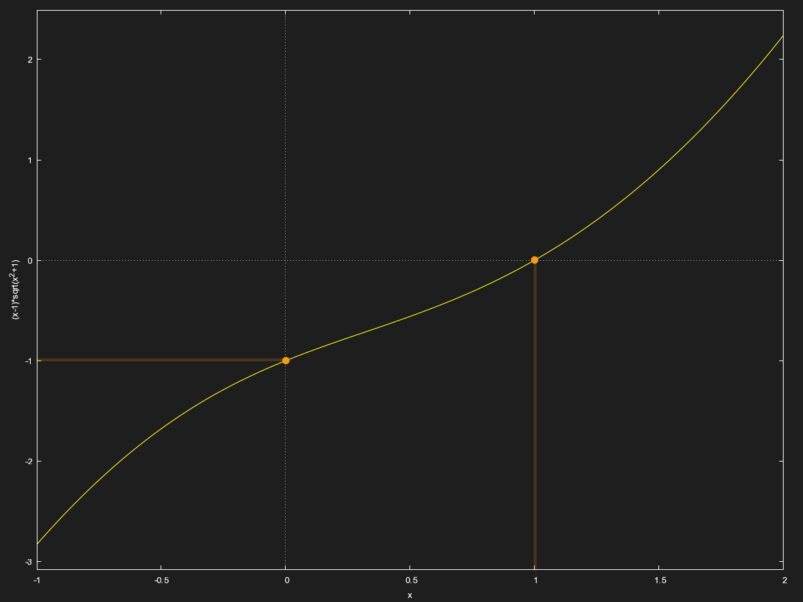
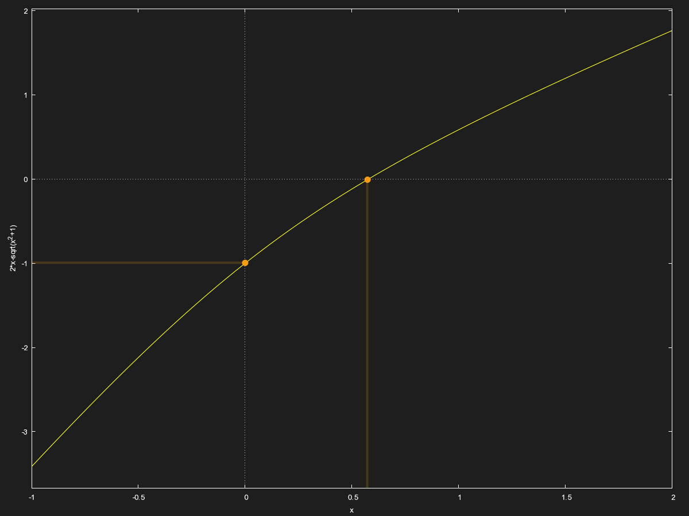
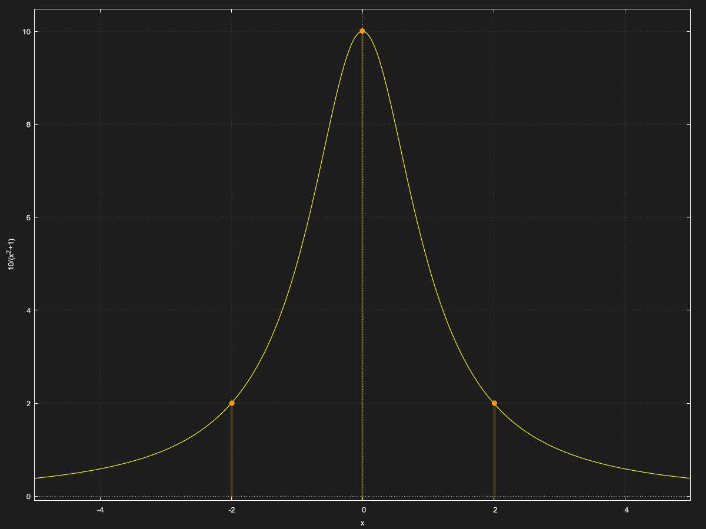
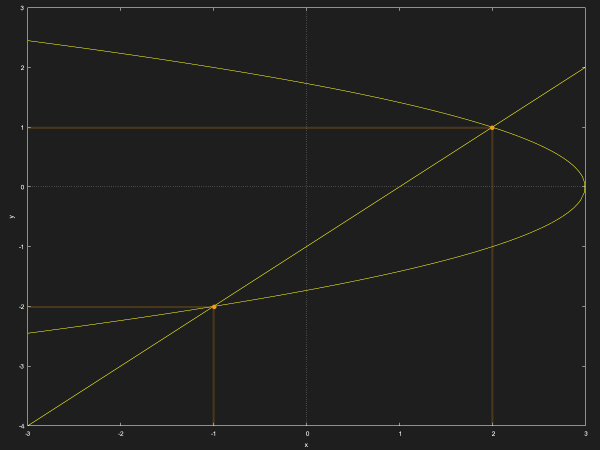
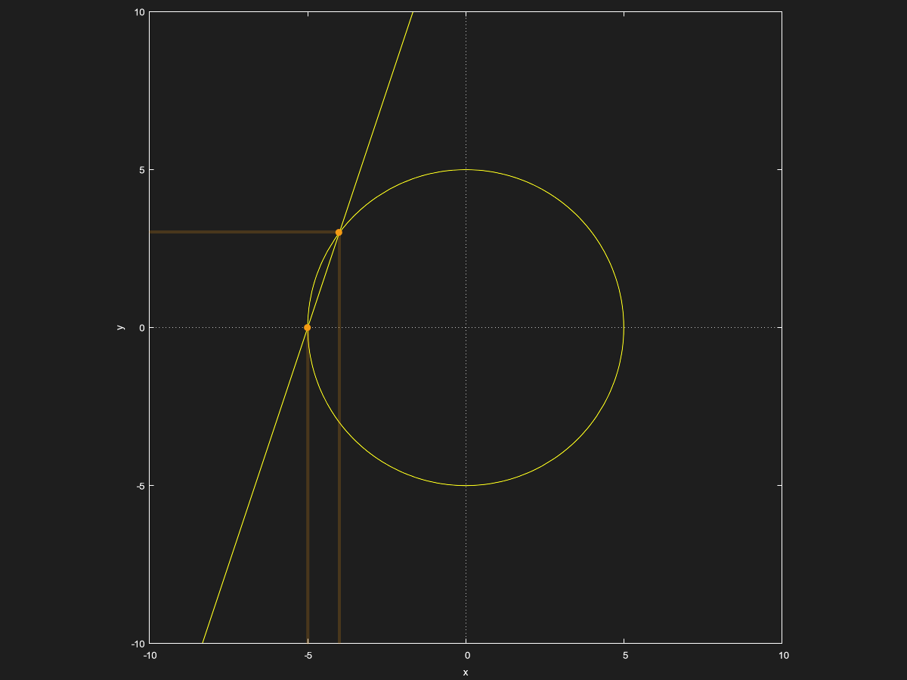

# Homework for [Chapter P.1](../W1/Chapter%20P.1):
*This chapter may look wrong if you are not using Obsidian. Please take a look at the [PDF export](../../PDF%20Exports/Calculus%20Chapter%20P.1%20Homework.pdf) instead.*

## Q2:

## Q11:

> Sketch the graph of the equation $y = \sqrt{x} - 6$ by point plotting. 

| $x$ | $y$ |
|---|---|
| $0$ | $-6$ |
| $4$ | $-4$ |
| $9$ | $-3$ |

## Q24:
> Find any intercepts of the equation $y = (x-1)\sqrt{x^2 + 1}$

1. Evaluate at $x = 0$:  
	$y = (0-1)\sqrt{0^2+1}$  
	$y = -\sqrt{1} = -1$  
Therefore, the $y$ intercept of the equation is $(0, -1)$.

2. Evaluate at $y = 0$:  
	$(x-1)\sqrt{x^2+1} = 0$  

| $(x-1) = 0$ | $\sqrt{x^2+1} = 0$ |
| --- | --- |
| $x = 1$ | $x^2 + 1 = 0$ |
|      | $x^2 = -1$ |
|      | $x = \sqrt{-1} \text{(undefined)}$|

Therefore, the $x$ intercept of the equation is $(1, 0)$.

Here is a graph for reference:

## Q28:
> Find any intercepts of the equation $y = 2x - \sqrt{x^2 + 1}$

1. Evaluate at $x=0$:  
	$y = 2(0) - \sqrt{0^2 + 1}$  
	$y = -\sqrt{1} = -1$  
Therefore, the $y$ intercept of the equation is $0,-1$

2. Evaluate at $y=0$:  
	$2x - \sqrt{x^2 + 1} = 0$  
	$2x = \sqrt{x^2 + 1}$  
	$(2x)^2 = ±(x^2 + 1)$  
	$4x^2 = ±(x^2 + 1)$  
	$4x^2 ±(x^2 + 1) = 0$  

| $4x^2 + (x^2 + 1) = 0$ | $4x^2 - (x^2 + 1) = 0$ |
| --- | --- |
| $4x^2 + x^2 + 1 = 0$| $4x^2 - x^2 - 1 = 0$ |
| $5x^2 + 1 = 0$ | $3x^2 - 1 = 0$
| $5x^2 = -1$ | $3x^2 = 1$ |
| $x = \sqrt{\frac{-1}{5}} \text{(undefined)}$ | $x = \sqrt{\frac{1}{3}} ≈ 0.5773502691896257...$ |

Therefore, the $x$ intercept is $(\sqrt{\frac{1}{3}}, 0)$.

Here is a graph for reference:

## Q56:

> Sketch the graph of the equation $y = \frac{10}{x^2 + 1}$. Identify any intercepts and test for symmetry.

1. Function Properties:  
	- Since the function contains no $x$ variable in the numerator, $y \ne 0 \text{ } \forall x \in \mathbb{R}$.
	-  The domain of the equation is $\{x \in \mathbb{R}\}$, because $x^2 + 1 \ne 0 \text{ } \forall x \in \mathbb{R}$.

2. Symmetries:  
	-  $x$ axis symmetry test:  
		$y = \frac{10}{x^2 + 1} \text{, \ \ \ substitute } (-y) \text{ for y:}$  
		$(-y) = \frac{10}{x^2 + 1}$  
		$y = -\frac{10}{x^2 + 1}$  
		$\{y = -\frac{10}{x^2 + 1}\} \ne \{y = \frac{10}{x^2 + 1}\}$  
	Therefore, this equation is not symmetrical with respect to the $x$ axis.
	
	- $y$ axis symmetry test:
		$y = \frac{10}{x^2 + 1} \text{, \ \ \ substitute } (-x) \text{ for x:}$
		$y = \frac{10}{(-x)^2 + 1}$
		$y = \frac{10}{x^2 + 1}$
		$\{y = \frac{10}{x^2 + 1}\} = \{y = \frac{10}{x^2 + 1}\}$
	Therefore, this equation is symmetrical with respect to the $y$ axis.  
	  
	- In fact, it is unnecessary to test for symmetry with respect to the origin now. And this is a proof why:  
		$\text{Let }f(x) = y\text{}$  
		$f(x) = f(-x)\text{ as shown previously.}$  
		$f(x) \ne -f(x) \text{ as shown previously.}$  
		$f(-x)\stackrel{?}{=}-f(x)$  
		$\text{Substitute }f(x)\text{ for }f(-x)\text{ since they are equal:}$  
		$f(x)\stackrel{?}{=}-f(x)$  
		$\text{Since it was shown that }f(x) \ne -f(x)\text{ and since }f(x) = f(-x)\text{, }$   
		$f(-x) \ne -f(x)$  		$\text{An equation is symmetric with respect to the origin if and only if }f(-x) = -f(x).$  $\text{Since }f(-x) \ne -f(x)\text{, the equation is not symmetric with respect to the origin.}$  

3. Graph:

| $x$ | $y$ | 
| --- | --- |
| $2$ | $2$ |
| $-2$ | $2$ |
| $3$ | $1$ |
| $-3$ | $1$ | 

## Q66:
> Find the points of intersection of the following equations:
   $\left\{ \begin{aligned}   x &= 3 - y^2 \\ y &= x - 1 \end{aligned} \right.$

1. Solve for $y$ by elimination:  
	$\left\{ \begin{aligned}   x &= 3 - y^2 \\ y &= x - 1 \end{aligned} \right.$
	$\left\{ \begin{aligned}  x - 3 &= -y^2 \\ y &= x - 1 \end{aligned} \right.$  
	$\left\{ \begin{aligned}   y^2 &= - x + 3 \\ y &= x - 1 \end{aligned} \right.$  
	$y^2 + y = 2$  
	$y^2 + y - 2 = 0$  
	$(y-1)(y+2) = 0$  
	$y = 1 \text{ and } y = -2$  

2. Substitute $y$ in the equations:  
	$x = 3 - y^2\text{, \ \ \ substitute }y=1$  
	$x = 3 - (1)^2 = 2$  
	  
	$x = 3 - y^2\text{, \ \ \ substitute }y=-2$  
	$x = 3 - (-2)^2 = 3 - 4 = -1$  

Therefore, the points of intersection are $(2,1)$ and $(-2, -1)$.

Here is a graph for reference:

## Q68:
> Find the points of intersection of the following equations:
   $\left\{ \begin{aligned}   x^2 + y^2 &= 25 \\ -3x + y &= 15 \end{aligned} \right.$  

1. Solve for $y$:  
	$-3x + y = 15$  
	$y = 3x+15$  

2. Solve for $x$ via substitution:  
	$x^2 + y^2 = 25\text{, \ \ \ substitute }y=3x+15$  
	$x^2 + (3x + 15)^2 = 25$  
	$x^2 + 9x^2 + (2)(15)(3)x + 15^2 = 25$  
	$10x^2 + 90x + 225 = 25$  
	$10x^2 +90x +200 = 0$  
	$x^2 + 9x + 20 = 0$  
	$x^2 + 4x + 5x + 20 = 0$  
	$x(x + 4) + 5(x+4) = 0$  
	$(x+4)(x+5) = 0$  
	$x = -4\text{ and }x = -5$  

3. Back-substitute to solve for $y$:  
	$y = 3x + 15\text{, \ \ \ substitute }x=-4$  
	$y = 3(-4) + 15 = -12 + 15 = 3$  
	  
	$y = 3x + 15\text{, \ \ \ substitute }x=-5$  
	$y = 3(-5) + 15 = -15 + 15 = 0$  

Therefore, the points of intersection are $(-4,3)$ and $(-5, 0)$.

Here is a graph for reference:
