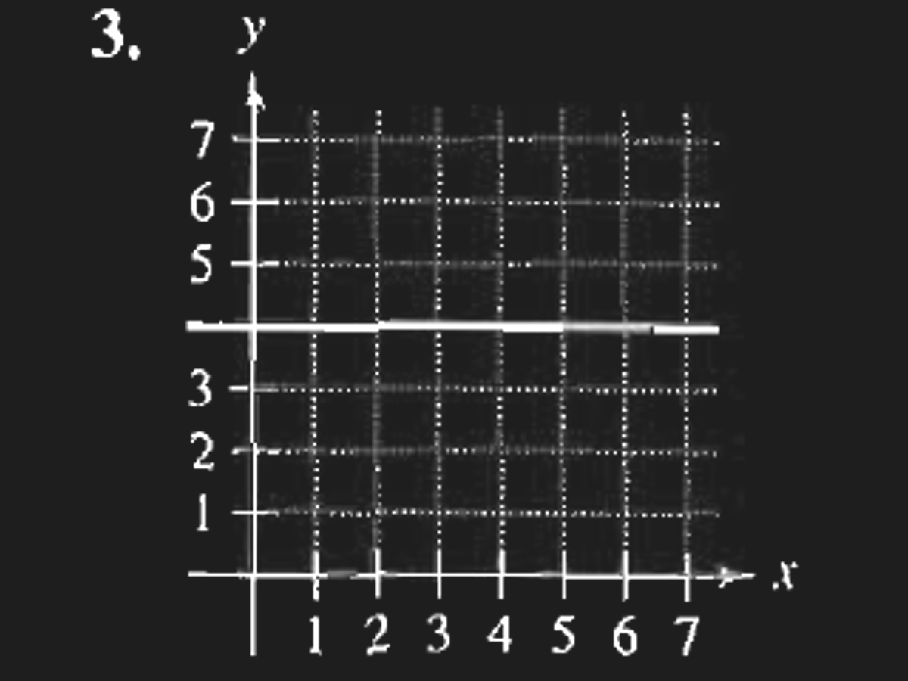
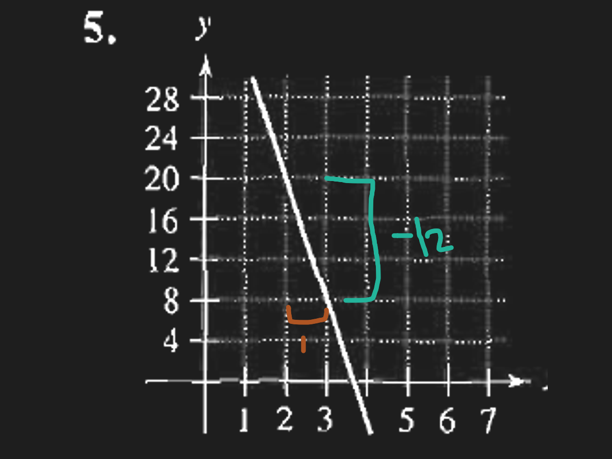
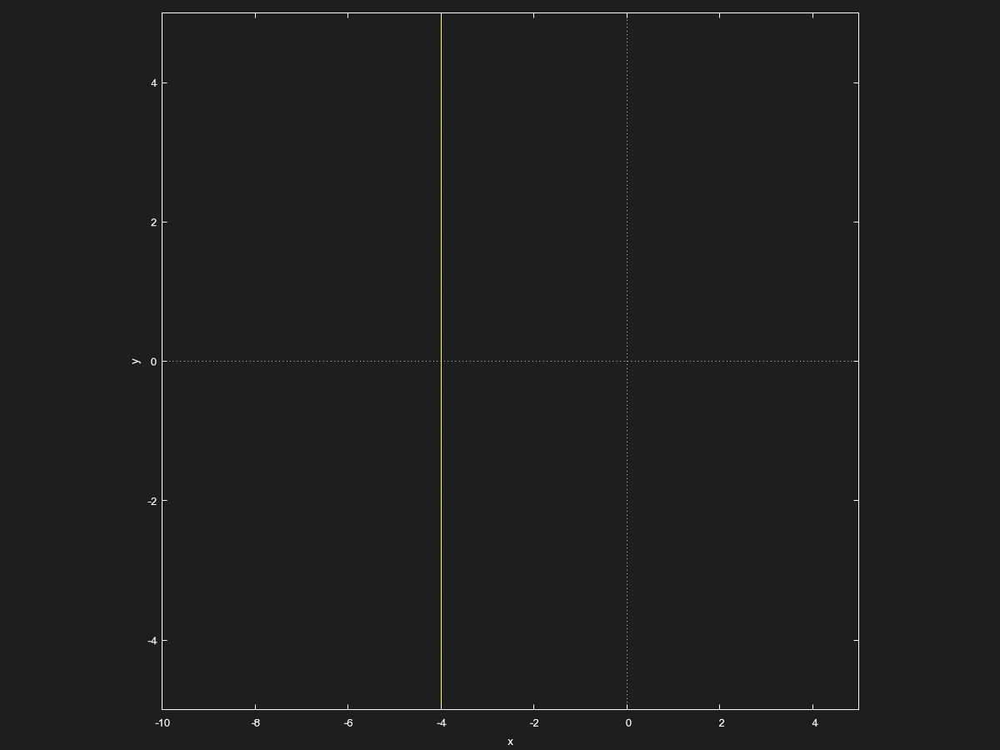
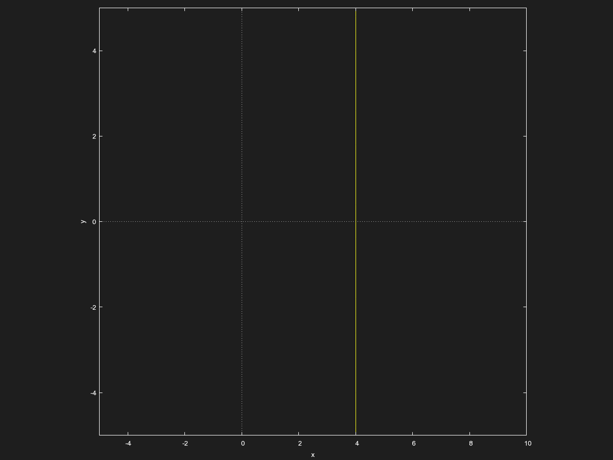
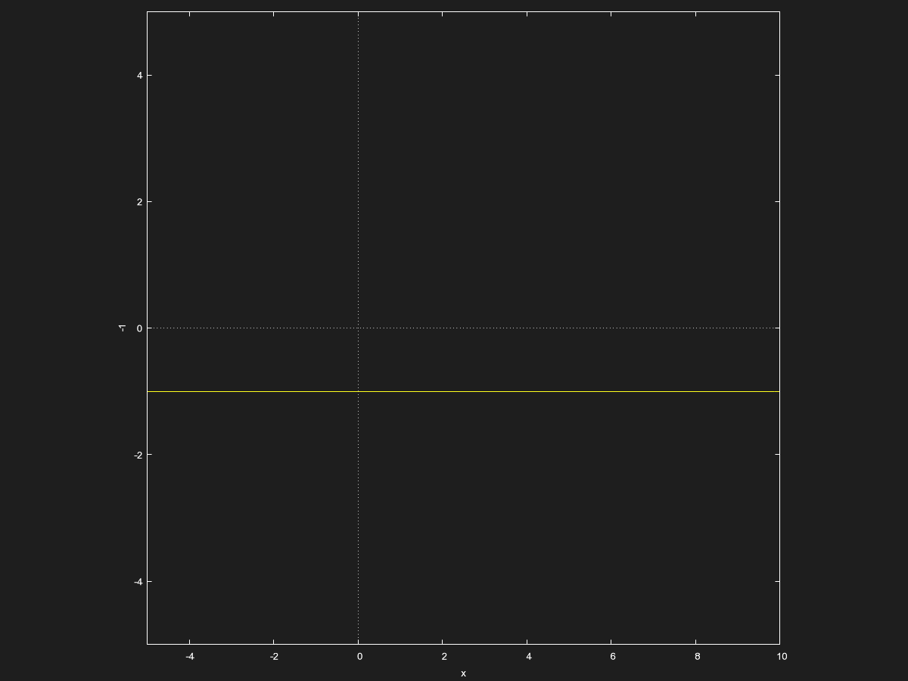
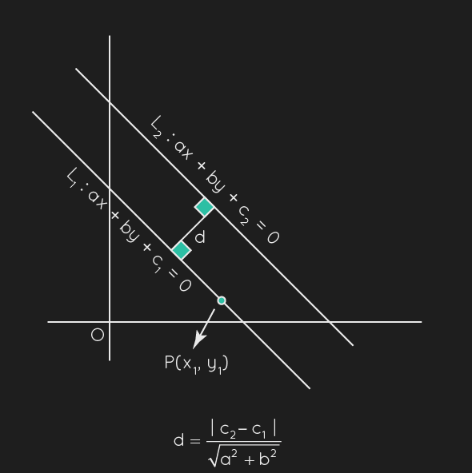

# Homework for [Chapter P.2](../W1/Chapter%20P.2.md):
*This file may look wrong if you are not using Obsidian. Please take a look at the [PDF export](../../PDF_Exports/Calculus%20Chapter%20P.2%20Homework.pdf) instead.*

## Q3:

> Estimate the graph's slope:

Looks like slope of $0$ to me.

## Q5:

> Estimate the graph's slope:

Looks like $-12$ slope to me.

## Q16:

> Use the point $(-4, 3)$ to find a line and 3 additional points the line goes through if its slope is undefined.

Literally $x = -4:$

Replace the $y$ in the points but keep $x$ intact and you infinite points to choose from.

## Q27: 
> Find the slope and $y$ intercept of the following line:
> $$ x = 4$$

Literally undefined slope and no $y$ intercept moment:

## Q28:

> Literally the above but the equation is $$y = -1$$

Me when $0$ slope and $0$ as the $y$ intercept:

## Q46:

> Show that the line with intercepts $(a, 0)$ and $(0, b)$ has the following equation: $$\frac{x}{a} + \frac{y}{b} = 1, a\ne 0, b\ne0$$

Ahem:
	$y\text{ intercept is when } x = 0$   
	$\frac{0}{a} + \frac{y}{b} = 1$  
	$y = b$  
	  
	$x\text{ intercept is when }y=0$
	$\frac{x}{a} + \frac{0}{b} = 1$
	$x = a$ 
	$QED.$

## Q91:

> Find the distance between these lines:
>$\left\{ \begin{aligned}   x +y = 1 \\ x + y = 5 \end{aligned} \right.$

.png)
$\text{Distance = }\frac{\sqrt{32}}{2} = 2\sqrt{2}$ 
