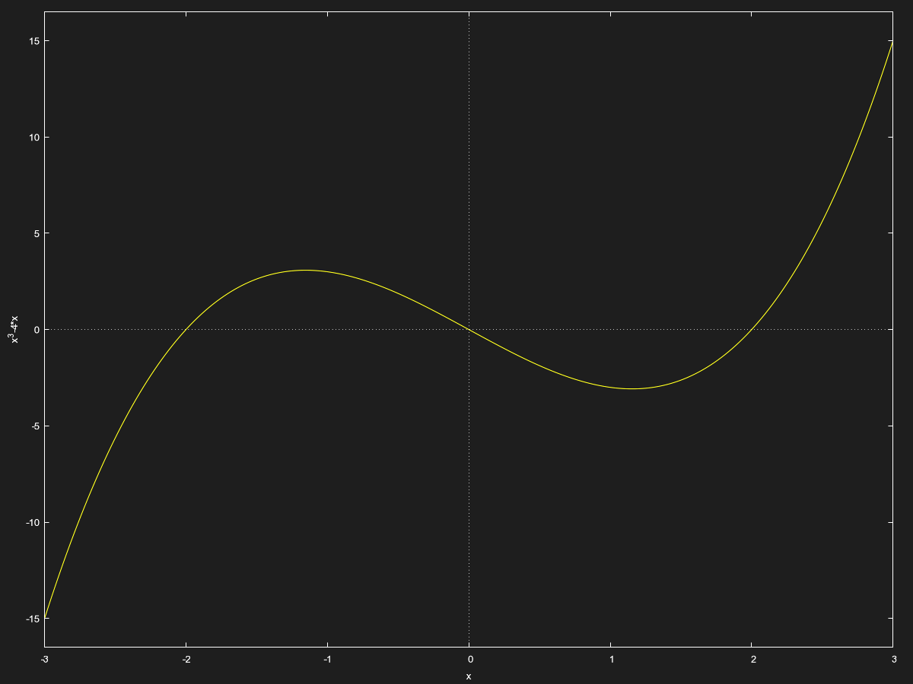
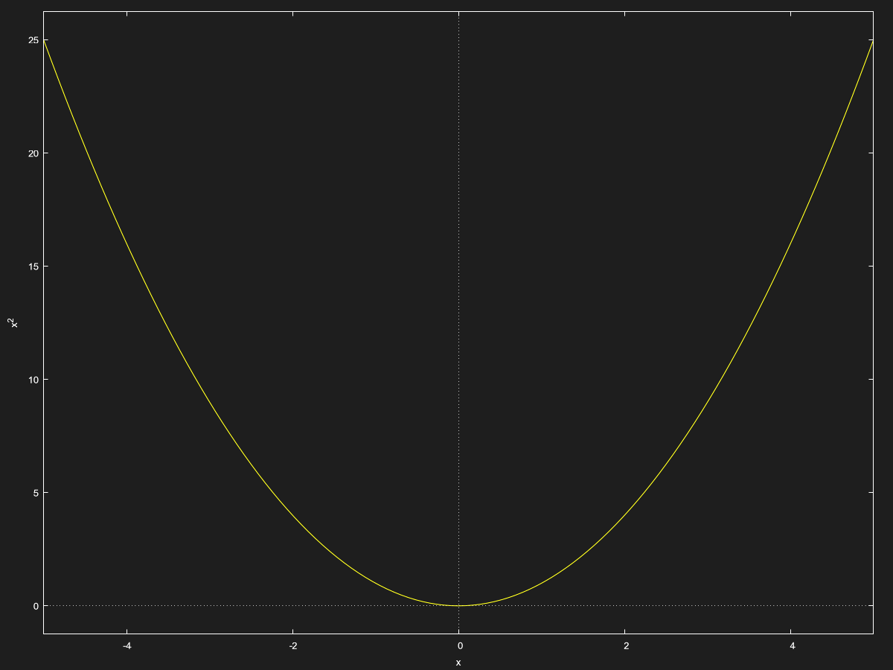

The heart of Calculus is at manipulating functions. As such, it is necessary to be familiar functions and their graphs, alongside important properties that will be crucial for solving and working with them.

## Intercepts

Intercepts are the places in the graph where the function crosses the X or Y axis(es).
- $x$ intercept is when $y = 0$
- $y$ intercept is when $x  = 20$

For instance, *$y = x^3 - 4x$:

The $x$ intercepts are ${(2,0), (0,0), (-2,0)}$*
The $y$ intercepts is $(0,0)$
The $y$ intercepts correspond to solutions of the function, the so called *zeros* of the function.

## Symmetry

Symmetry is a rather important property of functions as it allows us to predict a function's behaviour accurately. In addition, it's massively useful for computers and calculators.

Symmetry comes in 3 kinds:
1. $x$ axis symmetry.
2. $y$ axis symmetry.
3. Origin ($y = x$ line) symmetry.

For instance, $x^2$ is symmetric about the $y$ axis:

