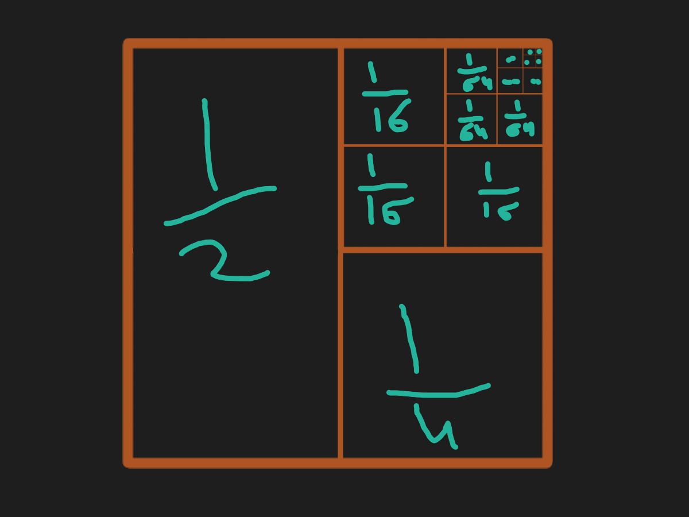
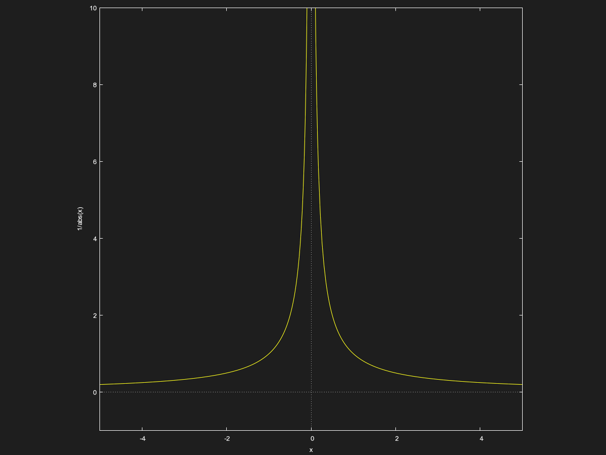

*This file may look wrong if you are not using Obsidian. Please take a look at the [Calculus - Chapter 1.1](../../PDF_Exports/Calculus%20-%20Chapter%201.1.pdf) instead.*
## The Concept of The Limit: 

Understanding the **idea** of a limit of extremely important to having a solid grasp on Calculus as a whole. And for this, we turn to the epic square:

This square has an area of $1$, but we have divided it into halves, quarters, 16'ths. and more. It is an infinite sum expressed as:
$$\frac{1}{2}+\frac{1}{4}+\frac{1}{8}+\frac{1}{16}+\frac{1}{32}+\frac{1}{64}+...$$

If we compute this with a calculator, we see that we get closer and closer to $1$, but we never quite *reach* it, as that would require infinite additions. Hence, we can say that the **limit** of the sum is $1$. Just as we know that the square is infinitely divided, but still has a finite area, we can say the limit of its area is 1. Meaning:

$$\sum_{x = 1}^{+\infty} \frac{1}{2^x} = \frac{1}{2}+\frac{1}{4}+\frac{1}{8}+\frac{1}{16}+\frac{1}{32}+\frac{1}{64}+... = 1$$

Another example: the graph of $|\frac{1}{x}|$

We see that as $x$ approaches $0$, the value of $y$ explodes. At $0$, the function becomes $\frac{1}{0}$, which is undefined. *However, the limit of the function is* $+\infty$. Since the limit does not require us to *reach* a certain value, but only **approach** it, we can properly define the limit like so:
$$\lim_{x \to 0} f(x) = |\frac{1}{x}| = +\infty$$ 

