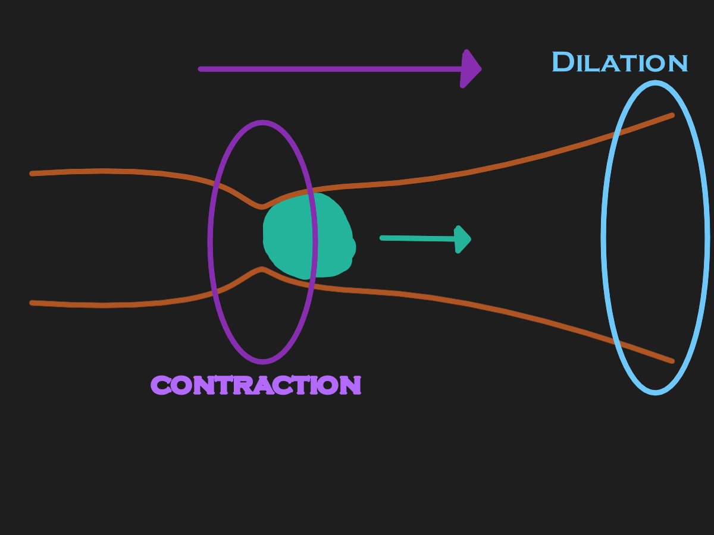

Food is essential for survival, as it gives us fuel to go about our lives. Our digestive system is quite elaborate and efficient in absorbing nutrients from foods. The digestive system is separated into two parts:

| Alimentary Tract | Accessory Organs |
|---| --- |
| Contains organs such as the mouth, pharynx, esophagus, stomach, small intestine, the colon, and the rectum. The food moves through said organs. | Contains organs such as the tongue (with teeth), salivary glands, liver, pancreas, gallbladder, etc. These organs provide secretions and aid in digestion of the food.

## Mouth

In the mouth, the teeth cut and physically break down the food. The saliva moistens the 
food, and begins digesting carbohydrates via salivary amylase.

## Pharynx and Esophagus

The epiglottis blocks the larynx and the airways, and then these two organs push the food from the mouth to the stomach via peristalsis (mixing waves of contraction and dilation).

See diagram for reference:

## Stomach

The food goes in the stomach where digestion begins. There are two sphincters between stomach and esophagus. and stomach and the small intestine. This is to make sure that the food (known as chyme in the stomach) would not get yeeted.

The stomach secretes gastric juices that break down the food, and begins churning and mixes the chyme via peristalsis. As the chyme hits the sphincter connecting to the intestine, a small portion of it moves through the sphincter to the intestine.